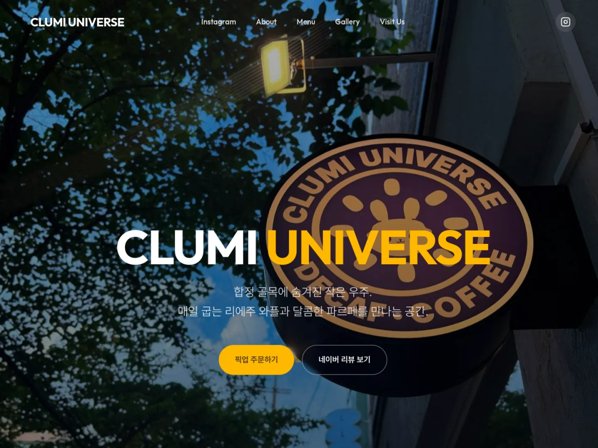

# CLUMI UNIVERSE

합정과 상수 사이 조용한 골목에 있는 감성 카페 **클루미 유니버스**의 공식 웹사이트입니다. 시그니처 파르페, 벨기에 리에주 방식의 수제 와플, 시즌 케이크와 와플 브런치를 소개하고 픽업 주문과 매장 방문으로 연결합니다.

[](https://clumiuniverse.netlify.app/)
[](https://github.com/kimcanal/clumiuniverse/actions/workflows/toss-menu-sync.yml)


[](https://clumiuniverse.netlify.app/)

> 합정과 상수 사이, 번잡한 홍대 레드로드를 벗어나 조용한 골목에서 따뜻한 위로와 작은 휴식을 전하는 감성 카페, 클루미 유니버스입니다. 날씨와 마음을 닮은 귀여운 캐릭터 스토리와 함께 매일 정성스럽게 준비하는 특별한 시그니처 디저트를 선보입니다.

네이버 지도에 등록된 소개 문구를 기준으로 파르페, 벨기에 리에주 방식의 수제 와플, 시즌 케이크, 와플 브런치의 특징을 페이지에 함께 보여줍니다.

## 주요 기능

- 토스오더 메뉴·가격·판매 상태·이미지·`인기`/`신규` 라벨 동기화
- 추천, 인기, 신규, 와플, 브런치, 커피, 디저트, 음료별 메뉴 탐색
- 네이버 지도 기반 매장 소개, 주소, 영업시간, 전화 연결
- 네이버 리뷰 하이라이트와 토스 픽업 주문 연결
- 데스크톱과 모바일에 대응하는 반응형 단일 페이지
- Netlify 장기 브라우저 캐시와 화면 밖 이미지 지연 로딩

## 데이터 운영 현황

| 데이터 | 원본 | 갱신 방식 | 주기 |
| --- | --- | --- | --- |
| 메뉴·가격·이미지 | [토스오더](https://store.tossplace.com/order/238090) | GitHub Actions 자동 동기화 | 매일 KST 06:00 + 수동 실행 |
| 추천 메뉴 | `data/featured.json` | 메뉴 ID를 직접 선택 | 필요할 때 |
| 숨김 메뉴 | `data/hidden-menu-items.json` | 노출하지 않을 메뉴 ID 관리 | 필요할 때 |
| 매장 소개·영업시간 | [네이버 지도](https://naver.me/F9hNJomf) | `data/store-info.json` 수동 관리 | 정보 변경 시 |
| 리뷰 하이라이트 | 네이버 방문자 리뷰 | `data/reviews.json` 수동 관리 | 필요할 때 |
| Instagram | [@clumi.universe](https://www.instagram.com/clumi.universe/) | 승인된 게시물과 이미지 추가 | 새 게시물 반영 시 |

Instagram 계정 소유자의 API 권한이 없으므로 공개 페이지를 우회 스크래핑하지 않습니다. 대신 공개 게시물 URL과 승인된 이미지를 한 명령으로 추가하며, 사이트는 `data/instagram.json`의 최신 4개를 자동으로 표시합니다.

## 토스 메뉴 동기화

```text
Toss Place 주문 데이터
        ↓
GitHub Actions · 매일 KST 06:00
        ↓
menu.json · menu.csv · 메뉴 이미지
        ↓
main 브랜치 커밋
        ↓
Netlify 자동 배포
```

동기화 스크립트는 메뉴의 실제 내용이 바뀐 경우에만 파일을 갱신합니다. 실행 시각이나 매장 영업 상태만 달라졌다면 커밋과 불필요한 Netlify 재배포를 만들지 않습니다.

수동으로 최신 메뉴를 받으려면 다음 명령을 실행합니다.

```bash
node scripts/fetch-toss-menu.mjs
```

이미지 다운로드 없이 데이터만 확인할 수도 있습니다.

```bash
node scripts/fetch-toss-menu.mjs --no-images
```

> 현재 스크립트는 토스오더 주문 페이지가 사용하는 공개 응답을 읽습니다. 토스 측 응답 형식이 바뀌면 스크립트 수정이 필요할 수 있습니다.

### 대표 메뉴 바꾸기

대표 메뉴는 `data/featured.json`에 적힌 메뉴 ID 순서대로 표시됩니다. 메뉴 ID는 `data/tossplace-menu/238090/menu.json`의 `items[].id`를 사용합니다.

```bash
node scripts/update-menu.mjs
```

검증만 하고 메뉴 선택과 배포를 건너뛰려면 다음처럼 실행합니다.

```bash
node scripts/update-menu.mjs --no-fetch --keep --no-deploy
```

`인기`와 `신규` 탭은 토스 메뉴의 `labels` 값을 자동으로 읽습니다. 소스, 옵션, 굿즈처럼 홈페이지 메뉴 카드에 어울리지 않는 항목은 `data/hidden-menu-items.json`에 ID를 추가해 숨깁니다.

## 매장 정보와 Instagram 수정

매장 소개, 주소, 영업시간, 전화번호와 네이버 지도 링크는 `data/store-info.json`에서 관리합니다.

- 화면용 영업시간: `hours.weekday`, `hours.weekend`, `hours.note`
- 오늘 영업 상태 계산: `businessHours.weekday`, `businessHours.weekend`
- 네이버 지도 링크: `links.naverMap`
- 네이버 지도 기준 소개 문구: `description`, `signatureMenus`, `closingMessage`

`businessHours`는 `HH:MM` 형식으로 입력합니다.

계정 소유자의 토큰 없이 Instagram 피드를 안정적으로 자동 수집하는 공식 방법은 없습니다. 공개 HTML 스크래핑은 로그인·차단·마크업 변경에 취약하므로 운영 자동화로 사용하지 않습니다. 새 게시물 이미지 한 장을 내려받은 뒤 다음 명령으로 추가할 수 있습니다.

```bash
node scripts/update-instagram.mjs \
  --url "https://www.instagram.com/p/게시물코드/" \
  --image "/내려받은/사진.jpg" \
  --caption "게시물을 설명하는 짧은 문장"
```

명령은 이미지를 `assets/instagram/`으로 복사하고 새 게시물을 맨 앞에 넣은 뒤 최근 4개만 유지합니다. 사이트는 이 파일을 읽고, 로드에 실패할 경우 HTML에 포함된 기존 게시물을 그대로 보여줍니다.

## 화면 구성과 참고 방향

현재 정보 순서는 **Hero(카페 전경) → Menu(대표 음식) → About(캐릭터) → Gallery(공간) → Reviews → Instagram → Visit**입니다. 방문자가 먼저 장소를 인지하고, 가장 중요한 메뉴를 확인한 뒤 캐릭터 세계관과 공간을 둘러보도록 구성했습니다. 리뷰는 방문 결정을 돕는 핵심 신뢰 정보라 Instagram보다 먼저 두고, Instagram은 최신 분위기를 보강하는 콘텐츠로 사용합니다.

비교할 만한 카페 사이트는 다음과 같습니다.

- [Blue Bottle Coffee](https://bluebottlecoffee.com/): 상품과 매장 탐색을 우선하는 명확한 정보 구조
- [TERAROSA](https://terarosa.com/): 브랜드 이야기, 공간, 상품을 함께 보여주는 편집형 구성
- [Anthracite Coffee](https://anthracitecoffee.com/): 절제된 비주얼과 브랜드 중심의 표현

클루미 유니버스는 대형 브랜드처럼 상품군을 넓히기보다 **카페 전경 → 대표 디저트 → 캐릭터 → 공간 → 방문/픽업**의 짧은 전환 경로를 유지하는 편이 적합합니다. 같은 성격의 사진을 연속 배치하기보다 음식, 캐릭터, 공간을 교차해 화면 리듬을 만듭니다.

## 로컬 실행

별도 빌드나 패키지 설치가 필요하지 않은 정적 사이트입니다.

```bash
python3 -m http.server 8000
```

브라우저에서 `http://localhost:8000`을 열면 됩니다. `file://`로 직접 열면 JSON `fetch`가 차단될 수 있으므로 로컬 서버를 사용합니다.

## 배포

프로덕션 주소는 <https://clumiuniverse.netlify.app/>입니다. `main` 브랜치가 갱신되면 Netlify가 저장소 루트를 정적 자산으로 자동 배포합니다.

`_headers`는 브라우저와 Netlify CDN 캐시를 따로 제어합니다. 일반 이미지는 브라우저에서 하루, Netlify 엣지에서 1년간 캐시하고, 콘텐츠 해시가 포함된 토스 메뉴 이미지는 양쪽에서 1년간 캐시합니다. 메뉴·Instagram JSON은 브라우저가 항상 재검증하되 Netlify 엣지에서는 5분간 보관해 원본 요청을 줄입니다. HTML은 엣지에서 1분만 보관합니다. 첫 화면의 Hero 이미지만 우선 다운로드하고 나머지 이미지는 화면에 가까워질 때 내려받습니다.

`Cache-Control`은 방문자 브라우저용이고 `Netlify-CDN-Cache-Control`은 Netlify의 전 세계 엣지 캐시 전용입니다. 따라서 이 설정은 클라이언트 캐시만 사용하는 구성이 아닙니다. 같은 경로로 교체될 수 있는 일반 이미지는 브라우저에 `immutable`로 고정하지 않아 다음 배포 내용을 정상적으로 받을 수 있게 했습니다.

```bash
git status
git add <변경한 파일>
git commit -m "update: 변경 내용"
git push origin main
```

## 프로젝트 구조

```text
clumiuniverse/
├── .github/workflows/toss-menu-sync.yml
├── docs/screenshots/
├── index.html
├── styles.css
├── assets/
│   ├── bg/
│   ├── characters/
│   └── instagram/
├── data/
│   ├── featured.json
│   ├── hidden-menu-items.json
│   ├── instagram.json
│   ├── reviews.json
│   ├── store-info.json
│   └── tossplace-menu/238090/
│       ├── menu.json
│       ├── menu.csv
│       ├── state.json
│       └── images/
└── scripts/
    ├── fetch-toss-menu.mjs
    ├── update-instagram.mjs
    └── update-menu.mjs
```
